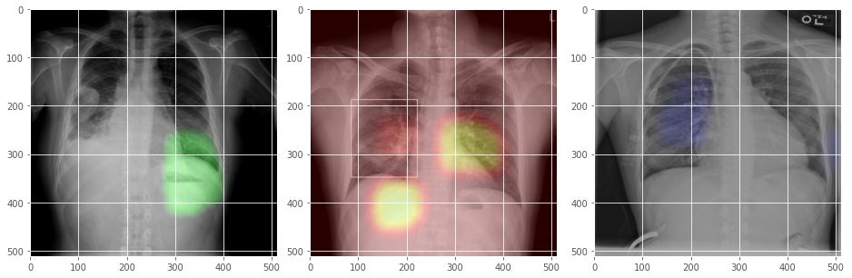

# RX-COVID-19

Repository that studies the detection of respiratory diseases in X-ray images using repositories with datasets for the detection of respiratory diseases related to Covid-19.

Detections

## Dataset-4C

The Dataset4C.hdf5 file consists in 396 images in RGB scale, divided in 4 classes. There are 277 training images, 59 validation images and 60 test images.(70% for training, 15% for validation and 15% for testing)

The classes are:

    Normal: 99
    Pneumonia Vir: 99
    Pneumonia Bact: 99
    COVID-19: 99
    
Size:

    (512,512,3)

You can find the dataset in the following link:

https://github.com/Serbeld/Dataset-4C
    
## Dataset 4C-D

The Dataset consists in a file with 3099 images in RGB scale, divided in 4 classes. There are 2169 training images, 465 validation images and 465 test images. (70% for training, 15% for validation and 15% for testing)

The classes are:

    Normal: 1000
    Pneumonia Vir: 1000
    Pneumonia Bact: 1000
    COVID-19: 99
    
Size:

    (512,512,3)
    
You can find the dataset in the following link:

https://github.com/Serbeld/Dataset-4C-D
    
## Dataset 5C

The dataset consists of 6700 RGB scale x-ray images, divided in 5 classes. There are 4690 training images, 1005 validation images and 1005 test images. (70% for training, 15% for validation and 15% for testing)

The classes are:

    Healthy: 1340 images
    Pneumonia & Covid-19: 1340 images
    Cardiomegaly: 1340 images
    Other respiratory disease: 1340 images
    Pleural effusion: 1340 images
    
Size:

    (512,512,3)
    
You can find the dataset in the following link:

https://github.com/Serbeld/Dataset5C

## Dataset 6C

The dataset consists of 8040 RGB scale x-ray images, divided in 6 classes. There are 5628 training images, 1206 validation images and 1206 test images. (70% for training, 15% for validation and 15% for testing)

The classes are:

    Healthy: 1340 images
    Pneumonia & Covid-19: 1340 images
    Cardiomegaly: 1340 images
    Other respiratory disease: 1340 images
    Pleural effusion: 1340 images
    Infiltration: 1340 images
    
 Size:

    (512,512,3)

You can find the dataset in the following link:

https://github.com/Serbeld/Dataset6C

